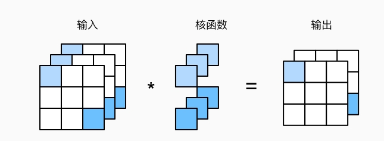

# 0. Pytorch基础

视频网址: https://www.bilibili.com/video/av74281036/

## 0_Pytorch_basics内容出自: p4-p7

三个常用命令:
```python
import torch
dir(torch.nn.functional)
help(torch.cuda.is_available)  

# 注意不是help(torch.cuda.is_available())
# help()也可以等同于??
# 比如torch.cuda.is_available??
```

0_Transforms_basics内容出自: p10-p13

0_NN_basics内容出自: p15-p24, p32


