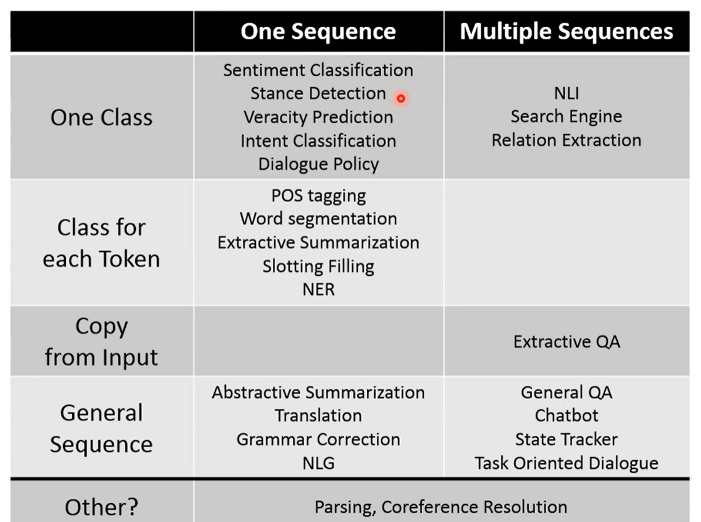
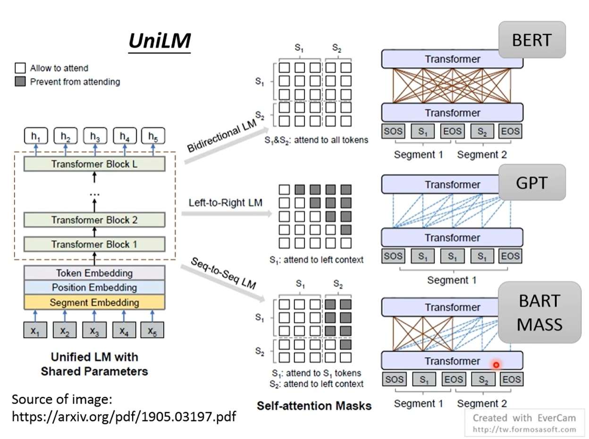

# 1. NLP基础

台大李宏毅视频网址: https://aistudio.baidu.com/education/group/info/2060

学习章节: 8. NLP任务总览; 9 & 10. BERT和它的家族; 11. GPT3

## NLP任务总览

主要任务: text-text, text-class

text-class: 文本分一个类, 每个字符一个类别

seq2seq + copy_mechanism

seq <SEP> seq 一起放入Model.

BERT是否需要word segmentation, parsing 以及 coreference resolution三种pre-processing呢?

i: seq  
o: class for each token  
(1) word segmentation, (2) parsing--涉及构建语法树, (3) coreference resolution, (4) extractive summarization

i: seq
o: seq
(1) abstractive summarization, (2) unsupervised machine translation, (3) grammar error correction

__unsupervised machine translation是最关键的, 没法弄到7000 * 7000的language pair来做一个翻译所有语言的大模型.__

i: seq  
o: cls  
(1) sentiment classification

## BERT

读大量文章+看往年试卷=得高分  
pre-train+task-specific=good model

representation演化路线: 从为token编码到为token+context编码

Contextualized Word Embedding model

LSTM, Self-attention layers, Tree-based model (解数学式任务的时候最强, 文法结构最严谨时最强, 其他时候不如别的model)

Transformer-XL, Reformer, Longformer

input: one sentence, multiple sentences ([SEP])  
output: one class ([CLS]), class for each token, copy from
 input (Extraction-based QA, 找一个开始POS一个结束POS达到extraction的效果), general sequence (使用[SEP]提示model开始生成sequence, 上个时刻生成作为下个时刻输入)

Adaptor Fine-Tune方法

如何把大语言模型的Loss图像画出来?  
Deep Learning Theory 2-5: Geometry of Loss Surfaces (Empirical): https://www.youtube.com/watch?v=XysGHdNOTbg  
https://arxiv.org/pdf/1908.05620

self-supervised learning

predict next token: ELMo (LSTM)

'You shall know a word by the company it keeps.'

Bert (no limitation on self-attention) 预测[MASK]或[Random Token], 完形填空

random masking到whole word masking (WWM) (ERNIE)

SpanBert - Span Boundary Objective (SBO)

XLNet (Transformer-XL) 随机看上下文预测[MASK] token

BERT不擅长generation任务

autoregressive model由左而右进行生成, 这个情形下BERT不擅长言辞

MASS, BART来做seq2seq任务

UniLM

Electra (由小的BERT来生成替代[MASK]的词汇作为干扰模型的输入)

sentence level embedding

MLM+NSP+SOP = BERT Task

Transfer Text-to-Text Transformer (T5)

Colossal Clean Crawled Corpus (C4)

## Language Models are Few-Shot Learners (GPT-3)

想做的事情: Zero-Shot Learning

few-shot learning: task description + examples + prompt

one-shot learning: task description + example + prompt

zero-shot learning: task description + prompt

In-Context Learning (不同于few-shot learning, 不Fine-Tune, 不做参数更新)

GPT-3不擅长做NLI (Natural Language Inference)问题

Turing Advice Challenge
http://rowanzellers.com/advice/

